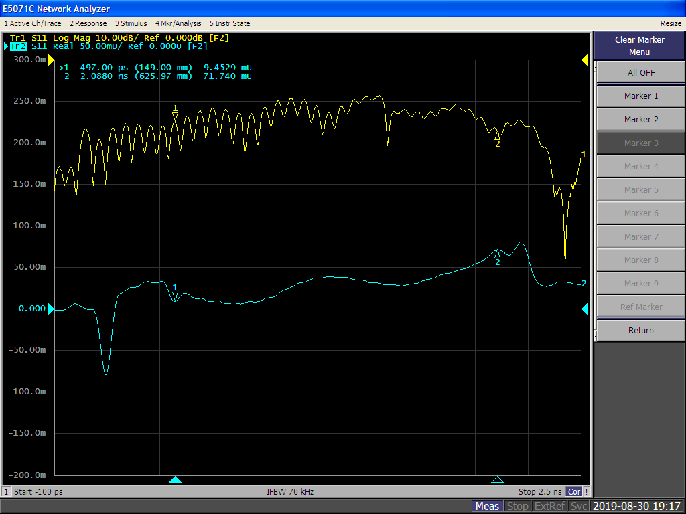

## 2019-08-30 E5071C-ENA
Measure and determine correct microstrip width for 50 ohm impedance on OSH Park's 4-layer stackup operating below 3 GHz.  Two 50 mm long microstrip test boards were measured with 0.34, and 0.40 mm widths, and a 180 mm long 0.38 mm width.  Phase velocity was also measured and effective permittivity was calculated by inducing discontinuties across the 180 mm long microstrip.

---

### Procedure

    1) Measure S11 and S21 for each board
    2) Analyze TDR from transformed S11
    3) Measure phase velocity and calculate effective permittivity

#### Equipment

    DUTs:
      - 50 mm long microstrip test boards; 0.34, 0.36, 0.38, and 0.40 mm widths
      - 180 mm long, 0.38 mm wide microstrip on OreSat's backplane
    VNA: Agilent E5071C ENA

#### Sweep Setup

    Start: 200 MHz
    Stop: 20 GHz
    Points: 401

#### Calibration

    Type: Full 2-port (open, short, load, thru)
    Kit:

#### TDR Setup
Simulated TDR based on the frequency domain transformation to time domain.  Time-domain reflectometry (TDR) uses input return loss scattering parameters (S11) in real format.

    Type: Low-pass mode
    Response: Step
    Window: Normal

#### Phase Velocity
The phase velocity of the microstrip can be calculated by using TDR to measure the time difference between two known discontinuties, and the physical difference distance.  From phase velocity the effective permittivity can be calculated.

    v_p = Δl / Δt = c / sqrt(ε_eff)
    ε_eff = ( Δt * c / Δl )^2

---

### Results

#### Impedance
- [TDR screen shot comparison](microstrips_TDR_compare.pdf)

#### Phase Velocity

The very long 0.38 mm wide microstrip on the backplane was used to measure the phase velocity.  Pieces of copper wire where placed over the microstrip to induce two known discontinuties.  While monitoring the TDR in real-time and pressing lightly on the copper pieces, markers were placed precisely on the induced discontinuties.

    Δl = 145.15 mm (avg)
    Δt = 795.5 ps

    v_p = 182.5e6 m/s
    ε_eff = 2.700

---

### Conclusion
The correct 50 ohm microstrip impedance may be 0.38 mm for below 3 GHz operation on OSH Park's 4-layer stackup.  The phase velocity of a 0.38 mm wide microstrip is 182.5e6 m/s, and the effective permittivity is 2.700.

---

### Reference
- [Agilent E5071C Manual](http://ena.support.keysight.com/e5071c/manuals/webhelp/eng/index.htm)
